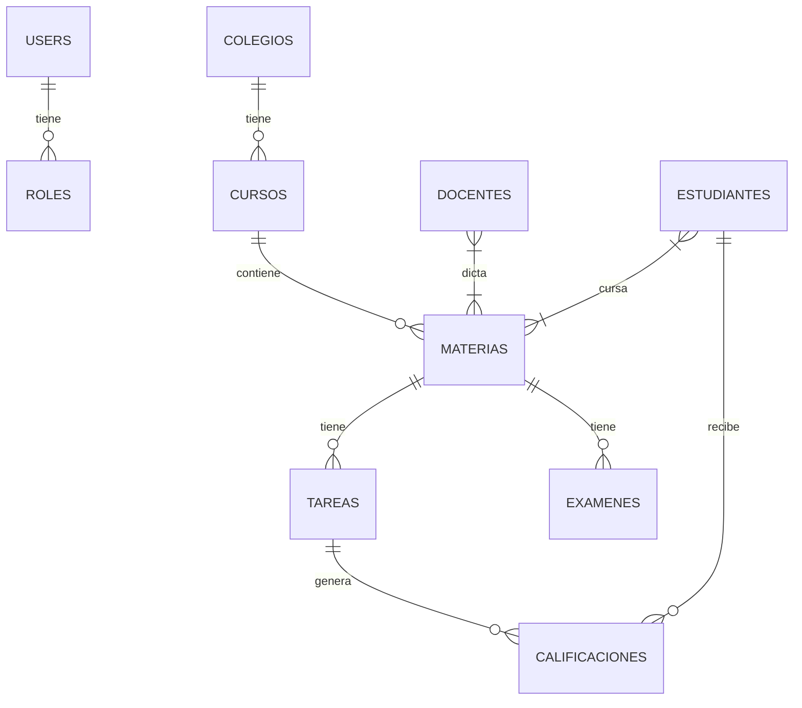

# Estructura de Base de Datos

El sistema utiliza una base de datos relacional MySQL. A continuación se describen las tablas principales y sus relaciones.

## Tablas Principales

### Usuarios y Roles

-   **users**: Tabla principal de usuarios.
    -   Campos: `id`, `name`, `apellido`, `email`, `password`, `rol`, `ci`, `telefono`, `direccion`.
-   **roles**: Definición de roles (Administrador, Docente, Estudiante).
-   **permisos**: Permisos granulares del sistema.
-   **rol_permisos**: Tabla pivote para asignar permisos a roles.

### Institucional

-   **colegios**: Información de las instituciones educativas.
-   **periodos_academicos**: Gestión de gestiones/años escolares.

### Académico

-   **cursos**: Cursos o grados.
-   **materias**: Asignaturas.
-   **docentes**: Información extendida de docentes.
-   **estudiantes**: Información extendida de estudiantes.
-   **docente_materia**: Asignación de docentes a materias.
-   **estudiante_materia**: Inscripción de estudiantes.

### Actividades y Evaluación

-   **tareas**: Tareas asignadas.
-   **examenes**: Evaluaciones.
-   **proyectos**: Proyectos académicos.
-   **calificaciones**: Registro de notas.
-   **asistencias**: Control de asistencia.

### Recursos

-   **libros**: Biblioteca digital.
-   **materiales**: Recursos subidos por docentes.

## Diagrama ER (Simplificado)

